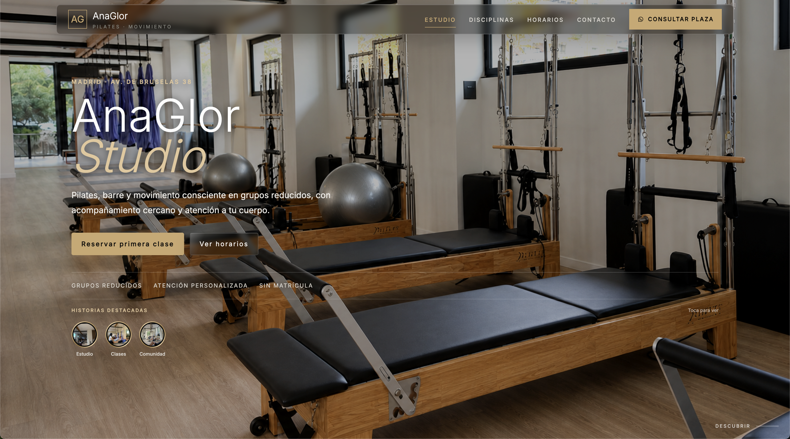
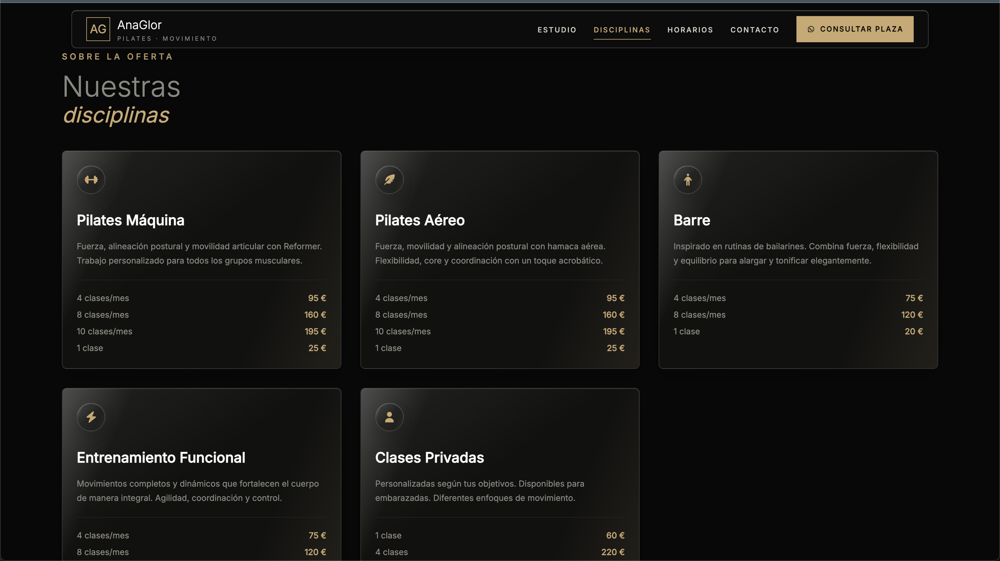
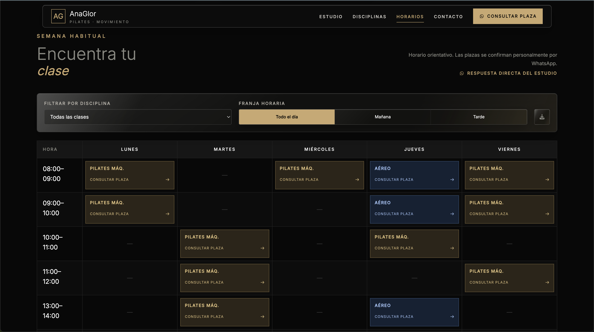
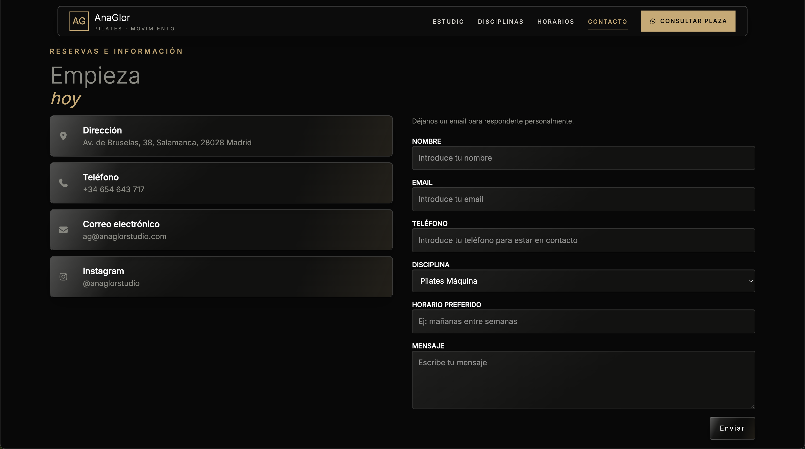

# AnaGlor Studio

Web para AnaGlor Studio, un estudio de Pilates, barre y movimiento consciente en Madrid. Proyecto real, desarrollado de principio a fin: diseño, frontend, base de datos, despliegue y dominio propio en producción. Trabajado en paralelo con los estudios de Ingeniería de Software y con el proyecto [DevJobs](https://github.com/GregorioEyiProjects/JobDev).

**En producción:** [www.anaglorstudio.com](https://www.anaglorstudio.com/)

---

## Capturas






---

## Stack

| Capa             | Tecnología                  |
| ---------------- | --------------------------- |
| Framework        | React + Vite                |
| Estilos          | Tailwind CSS v4             |
| Base de datos    | Supabase (PostgreSQL + RLS) |
| Email            | EmailJS                     |
| Iconos           | Font Awesome                |
| Captura a imagen | html2canvas                 |
| Hosting          | Vercel                      |
| Dominio          | IONOS                       |

---

## Funcionalidades implementadas

### Contenido dinámico

- Disciplinas y tarifas desde Supabase, relacionadas por clave foránea
- Horarios dinámicos con visibilidad configurable por clase
- Eventos con soporte para plazas limitadas y estado "próximamente"
- Políticas RLS con lectura pública en todas las tablas

### Hero

- Overlay de contraste sobre el fondo para legibilidad del texto
- CTA directo a WhatsApp con mensaje predefinido

### Galería e historias

- Visor de historias tipo Instagram renderizado con `createPortal`
- Autoplay con barra de progreso, pausa/reanudar y navegación anterior/siguiente
- Zonas táctiles laterales para avanzar y retroceder
- Navegable por teclado y con `aria` para accesibilidad
- Bloqueo de scroll de fondo mientras el visor está abierto

### Navegación y experiencia

- NavBar responsive con menú hamburguesa animado
- Animaciones de aparición al hacer scroll (`data-reveal` con IntersectionObserver)
- Descarga del horario como imagen generada en cliente con html2canvas

### Contacto

- Formulario validado con envío real de emails vía EmailJS
- Feedback de estado (enviando / enviado / error)

### Accesibilidad y rendimiento

- `prefers-reduced-motion` para desactivar animaciones
- Diseño mobile-first
- Métricas Core Web Vitals en verde (LCP, CLS)

---

## Arquitectura

El proyecto sigue una separación de responsabilidades por capas: los servicios no conocen React, los hooks encapsulan estado y efectos, y los componentes no contienen lógica de acceso a datos.

src/
├── components/ # Componentes de UI por sección
│ ├── NavBar/
│ ├── Hero/
│ ├── Sobre/
│ ├── Galeria/
│ ├── Disciplinas/
│ ├── Horarios/
│ ├── Eventos/
│ ├── Normas/
│ ├── Contacto/
│ └── Footer/
├── hooks/ # useEventos, useHorarios, useDisciplinas, useContactForm
├── services/ # supabaseClient + un servicio por entidad + emailService
├── utils/ # formMethods, descargarHorario
├── config/ # studio.js — datos centralizados del estudio
├── data/ # Contenido estático (historias, galería)
└── styles/ # global.js + index.css (tokens y clases utilitarias)

### Modelo de datos

| Tabla         | Campos principales                                                           |
| ------------- | ---------------------------------------------------------------------------- |
| `disciplinas` | id, nombre, icono, descripcion, activo                                       |
| `tarifas`     | id, disciplina_id (FK), label, precio                                        |
| `horarios`    | id, hora, dia, nombre, tipo, visible                                         |
| `eventos`     | id, titulo, descripcion, fecha, plazas_limitadas, link, proximamente, activo |

---

## Decisiones técnicas

**Contenido dinámico desde base de datos.** Horarios, disciplinas, tarifas y eventos cambian con frecuencia; servirlos desde Supabase evita redesplegar por cada cambio de contenido y sienta la base de un futuro panel de administración.

**Seguridad en la capa de datos, no en el cliente.** Las restricciones se definen con políticas RLS en Supabase, partiendo del principio de que cualquier control implementado solo en frontend es cosmético.

**Configuración centralizada.** Los datos del estudio (contacto, redes, URLs de media) viven en `config/`, evitando valores repartidos por los componentes.

---

## Infraestructura

- Despliegue continuo en Vercel desde el repositorio
- Dominio propio conectado por DNS (registro A para el apex, CNAME para `www`), preservando los registros MX del correo corporativo
- Certificado SSL automático
- Variables de entorno gestionadas desde Vercel

---

## Pendiente / No implementado

- **Panel de administración** en `/admin` con Supabase Auth, para que la propietaria gestione eventos, horarios, disciplinas y tarifas sin tocar la base de datos.
- **Traducción completa** — la integración de DeepL en todas las secciones.
- **Vídeo de fondo en el Hero** — versión optimizada y con fallback a imagen en móvil.
- **Tests** — sin cobertura de tests automatizados.

---

## Instalación

```bash
git clone https://github.com/GregorioEyiProjects/anaglor-studio
cd anaglor-studio
npm install
```

Crea un archivo `.env` con tus claves:

VITE_SUPABASE_URL=
VITE_SUPABASE_ANON_KEY=
VITE_EMAILJS_SERVICE_ID=
VITE_EMAILJS_TEMPLATE_ID=
VITE_EMAILJS_PUBLIC_KEY=

```bash
npm run dev
```

---

## Otros proyectos

**[DevJobs](https://github.com/GregorioEyiProjects/JobDev)** — app móvil de búsqueda de empleo tech con React Native + Expo, desarrollada en paralelo con este proyecto.

---

## Autor

**Gregorio Eyi** — Graduado en Ingeniería de Software. [GitHub](https://github.com/GregorioEyiProjects)
